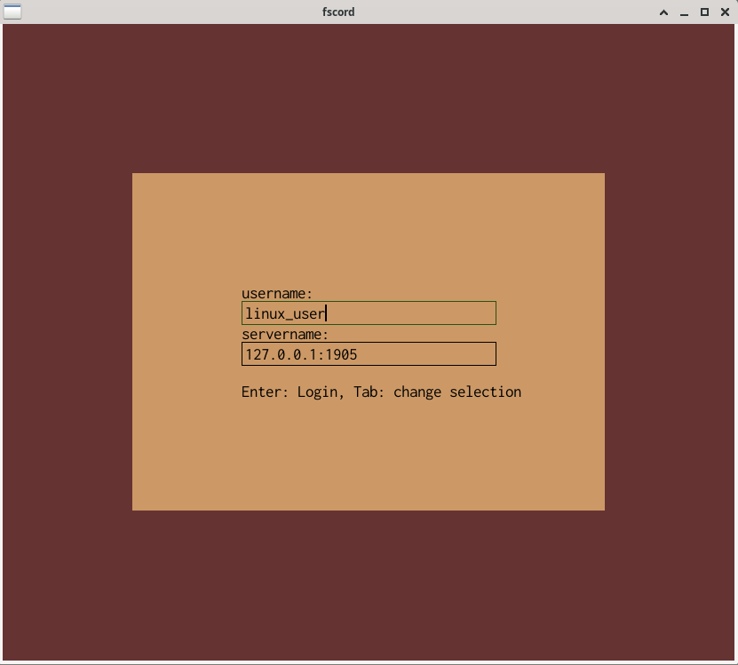
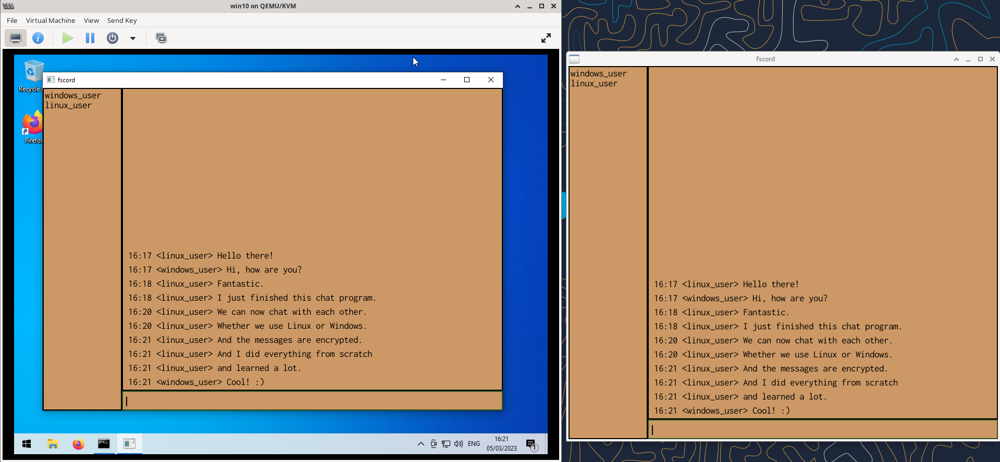

# fscord

## Build and Run on Linux
./compile.sh\
client: ./build/fscord\
server: ./run\_server

## Build and Run on Windows
1) install Visual Studio and clang
2) open cmd
3) execute: vcvarsall.bat x64\
   For me it's in the directory: C:\Program Files\Microsoft Visual Studio\2022\Community\VC\Auxiliary\Build
4) execute: compile.bat
5) execute: build\fscord.exe

## Pictures

  
  

